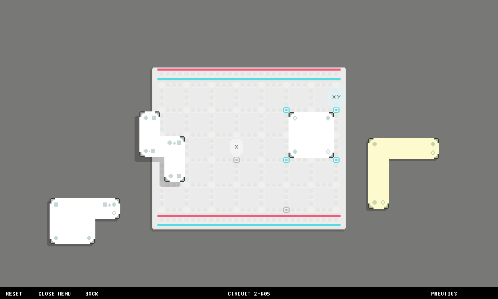
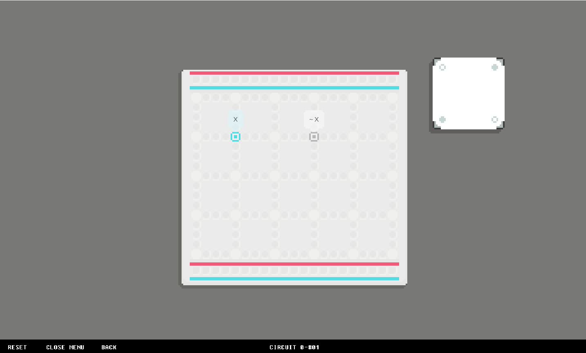
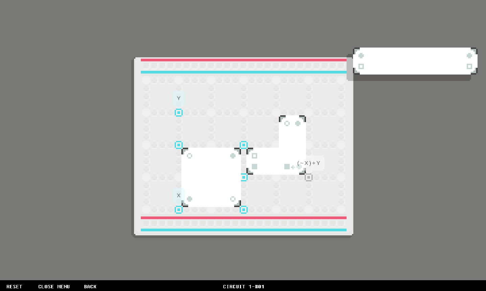
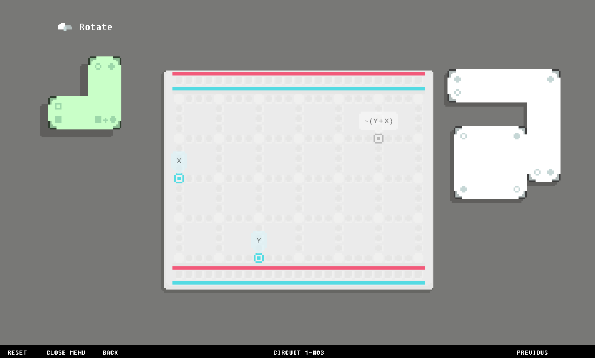
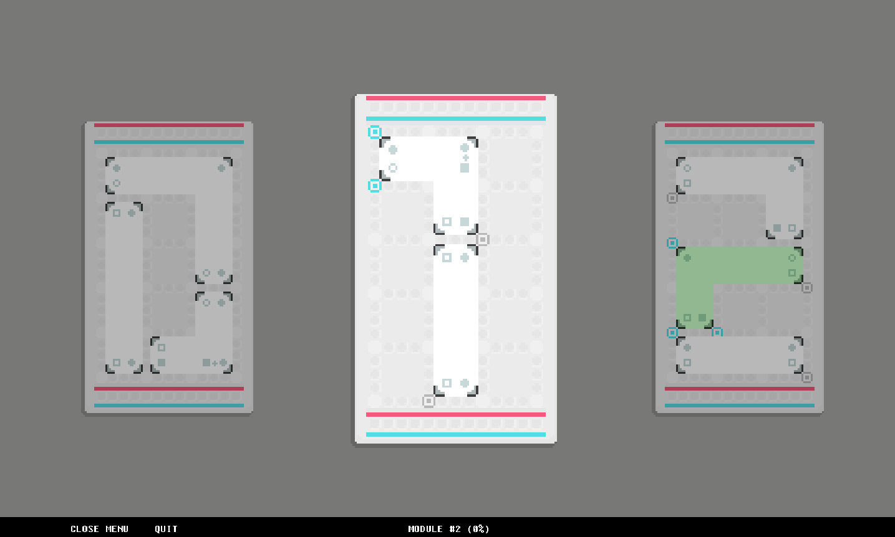

# NEMOCUITS
`puzzle` `logic` `circuit`

(25/09/15) 데모 [플레이](https://anoony22.itch.io/demo)
만든 사람: [imanoony](https://github.com/imanoony)

    

---

## overview

    
    
    
    

:electric_plug: **블록**을 배치해 논리식 회로를 오류 없이 완성하라
:zap: 블록의 **꼭짓점 포트**로 논리식을 전달할 수 있다
:bulb: 주어진 블록으로 회로의 입력과 출력을 연결하는 **논리 퍼즐**

---

## how to play

     
     
    
     
    

**블록**은 드래그 앤 드롭으로 움직일 수 있다

     
    
    

---

## what's next

---

## inspired by

- Blockus
- Mini Motorways
- Bento Blocks
